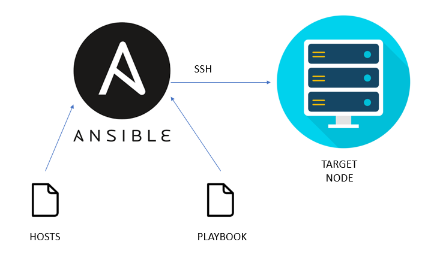

Ansible role: Ansible
=========

This role helps you to install ansible on your linux machine.


<<<<<<< HEAD
|Travis|GitHubActions|Quality|Downloads|Version|
|------|-------------|-------|---------|-------|
|[](https://travis-ci.com/amine7777/ansible-role-ansible)|[](https://github.com/amine7777/ansible-role-ansible/actions)|[](https://galaxy.ansible.com/amine7777/ansible)|[](https://galaxy.ansible.com/amine7777/ansible)|[](https://github.com/amine7777/ansible-role-ansible/releases/)|
=======
|Travis|CircleCI|GitHub|Quality|Downloads|Version|
|------|--------|------|-------|---------|-------|
|[](https://travis-ci.com/amine7777/ansible-role-ansible)||[](https://github.com/amine7777/ansible-role-ansible/actions)|[](https://galaxy.ansible.com/amine7777/ansible)|[](https://galaxy.ansible.com/amine7777/ansible)|[](https://github.com/amine7777/ansible-role-ansible/releases/)|
>>>>>>> 333114491981ddede64ebc1541d642fe39f7f070



Requirements
------------
- Linux machine
- Ansible 2.9

Role Variables
--------------

You can specify your ansible version in this variable.
```yaml
ansible_version: 2.9.6
```

Example Playbook
----------------

```yaml
- hosts: all
  vars:
    ansible_version: 2.9.13
  roles:
     - amine7777.ansible
```

Author Information
------------------

- [Amine Kahlaoui](https://github.com/amine7777), DevOps engineer.
